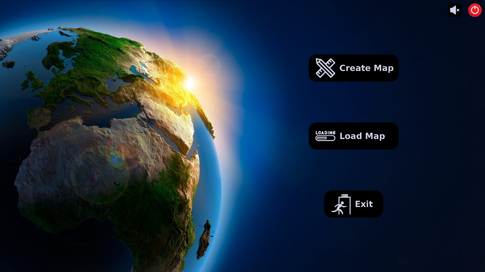
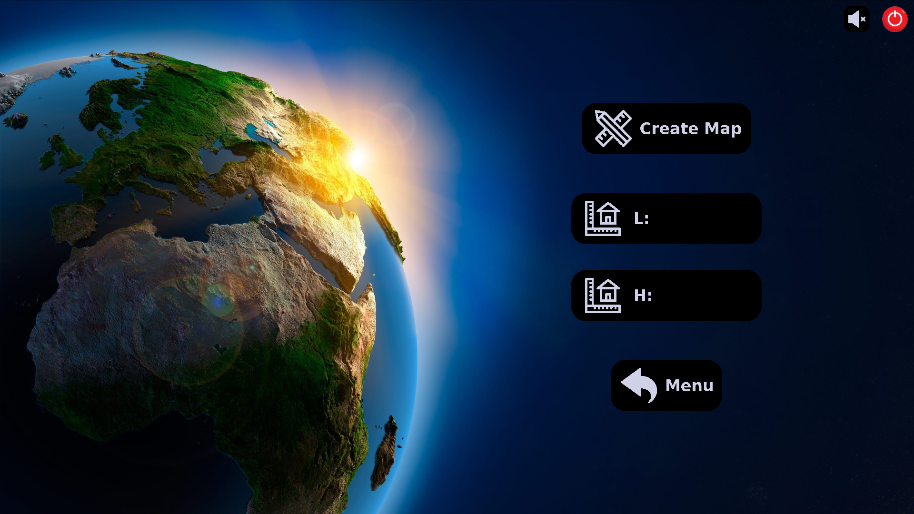
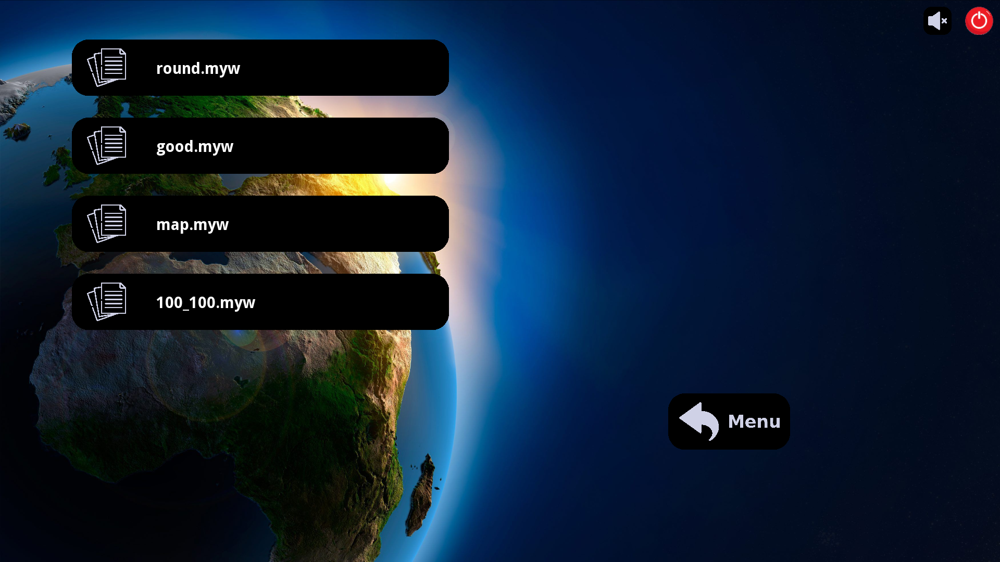
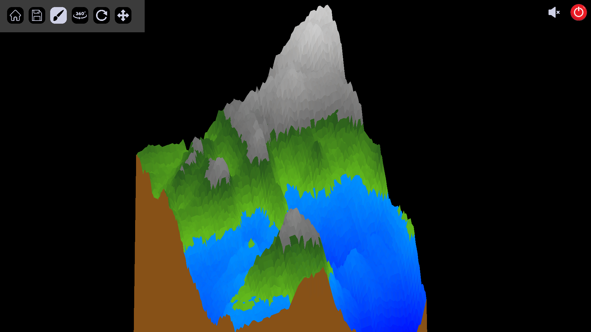
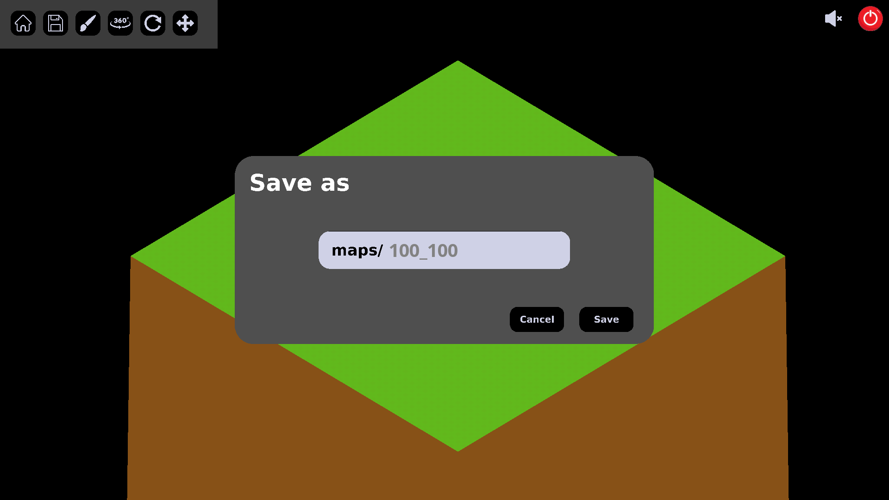

<h1 align="center">my_world<br>Epitech project</h1>

A terraformer program which allows you to modify, save and load 3d maps.

## Requirements

- CSFLM library
- Make

## Install

```sh
git clone git@github.com:Mazettt/my_world.git
make
```

## Usage

```sh
./my_world --help
./my_world
```

## Screenshots


<div>
    
    
</div>
<div>
    
    
</div>

## Authors

👤 **Martin d'Hérouville**

* Github: [@Mazettt](https://github.com/Mazettt)
* LinkedIn: [@martin-d-herouville](https://linkedin.com/in/martin-d-herouville)

👤 **Thomas Ott**

* Github: [@RedboardDev](https://github.com/RedboardDev)
* LinkedIn: [@thomas--ott](https://linkedin.com/in/thomas--ott)
